# OhDomi database ERD

The model stores operational facts and derives dashboard totals from them. It covers the current OhDomiReact screens without coupling the database to presentation-only cards or charts.

```mermaid
erDiagram
    APP_USERS ||--o{ STORES : owns
    APP_USERS ||--o{ BOARD_POSTS : writes
    APP_USERS ||--o{ BOARD_ANSWERS : answers
    APP_USERS ||--o{ NOTIFICATIONS : receives

    STORES ||--o{ STAFF_SHIFTS : schedules
    STORES ||--o{ FACILITIES : has
    FACILITIES ||--o{ FACILITY_CHECKS : checked_by

    STORES ||--o{ CUSTOMER_ORDERS : receives
    CUSTOMER_ORDERS ||--|{ CUSTOMER_ORDER_ITEMS : contains
    MENU_ITEMS ||--o{ CUSTOMER_ORDER_ITEMS : sold_as

    STORES ||--o{ INVENTORY_ITEMS : stocks
    INVENTORY_ITEMS ||--o{ ORDER_RECOMMENDATIONS : receives
    STORES ||--o{ PURCHASE_ORDERS : places
    PURCHASE_ORDERS ||--|{ PURCHASE_ORDER_ITEMS : contains
    INVENTORY_ITEMS ||--o{ PURCHASE_ORDER_ITEMS : ordered_as

    STORES ||--o{ HYGIENE_INSPECTIONS : undergoes
    HYGIENE_INSPECTIONS ||--|{ HYGIENE_CHECK_RESULTS : evaluates
    HYGIENE_INSPECTIONS ||--o{ HYGIENE_IMAGES : analyzes
    HYGIENE_INSPECTIONS ||--o{ IMPROVEMENT_TASKS : creates

    STORES ||--o{ RISK_ASSESSMENTS : assessed_by
    STORES ||--o{ BOARD_POSTS : concerns
    BOARD_POSTS ||--o| BOARD_ANSWERS : has
    STORES ||--o{ NOTIFICATIONS : triggers

    APP_USERS {
      bigint user_id PK
      varchar login_id UK
      varchar password_hash
      varchar name
      varchar role
      boolean active
    }
    STORES {
      bigint store_id PK
      bigint owner_user_id FK
      varchar store_code UK
      varchar name
      varchar region
      varchar address
      date contract_ends_on
      decimal monthly_sales_target
    }
    CUSTOMER_ORDERS {
      bigint customer_order_id PK
      bigint store_id FK
      varchar channel
      timestamp ordered_at
      decimal total_amount
      varchar status
    }
    CUSTOMER_ORDER_ITEMS {
      bigint customer_order_item_id PK
      bigint customer_order_id FK
      bigint menu_item_id FK
      int quantity
      decimal unit_price
    }
    MENU_ITEMS {
      bigint menu_item_id PK
      varchar name UK
      varchar category
      decimal price
    }
    INVENTORY_ITEMS {
      bigint inventory_item_id PK
      bigint store_id FK
      varchar item_name
      varchar unit
      decimal current_quantity
      decimal reorder_level
      decimal unit_price
    }
    ORDER_RECOMMENDATIONS {
      bigint recommendation_id PK
      bigint inventory_item_id FK
      date recommendation_date
      decimal expected_usage
      decimal recommended_quantity
      varchar risk_level
    }
    PURCHASE_ORDERS {
      bigint purchase_order_id PK
      bigint store_id FK
      varchar order_number UK
      varchar status
      decimal total_amount
    }
    PURCHASE_ORDER_ITEMS {
      bigint purchase_order_item_id PK
      bigint purchase_order_id FK
      bigint inventory_item_id FK
      decimal quantity
      decimal unit_price
    }
    HYGIENE_INSPECTIONS {
      bigint inspection_id PK
      bigint store_id FK
      int score
      varchar status
      varchar reviewer
      timestamp inspected_at
    }
    HYGIENE_CHECK_RESULTS {
      bigint check_result_id PK
      bigint inspection_id FK
      varchar item_name
      int score
      varchar status
    }
    HYGIENE_IMAGES {
      bigint image_id PK
      bigint inspection_id FK
      varchar image_url
      varchar category
    }
    IMPROVEMENT_TASKS {
      bigint improvement_task_id PK
      bigint inspection_id FK
      varchar priority
      varchar status
      timestamp due_at
    }
    RISK_ASSESSMENTS {
      bigint risk_assessment_id PK
      bigint store_id FK
      decimal risk_score
      varchar risk_level
      decimal sales_change_rate
      int hygiene_score
      int delayed_order_count
      int complaint_count
      timestamp assessed_at
    }
    BOARD_POSTS {
      bigint post_id PK
      bigint author_user_id FK
      bigint store_id FK
      varchar board_type
      varchar category
      varchar status
      boolean is_pinned
      boolean is_urgent
      bigint view_count
    }
    BOARD_ANSWERS {
      bigint answer_id PK
      bigint post_id FK,UK
      bigint author_user_id FK
      clob content
    }
    FACILITIES {
      bigint facility_id PK
      bigint store_id FK
      varchar name
    }
    FACILITY_CHECKS {
      bigint facility_check_id PK
      bigint facility_id FK
      varchar status
      timestamp checked_at
    }
    STAFF_SHIFTS {
      bigint staff_shift_id PK
      bigint store_id FK
      date work_date
      time starts_at
      time ends_at
      varchar status
    }
    NOTIFICATIONS {
      bigint notification_id PK
      bigint store_id FK
      bigint recipient_user_id FK
      varchar level
      boolean is_read
    }
```

## REST resources

| Method | Path | Purpose |
|---|---|---|
| POST | `/api/auth/login` | Verify login ID, password hash, active status, and selected role |
| POST | `/api/auth/register` | Register a new owner account with a salted PBKDF2-SHA256 password hash |
| GET | `/api/stores` | Store and owner list |
| GET | `/api/stores/{storeId}` | Store profile |
| GET | `/api/stores/{storeId}/staff?date=YYYY-MM-DD` | Daily staff shifts |
| GET | `/api/stores/{storeId}/facilities` | Latest facility checks |
| GET | `/api/stores/{storeId}/sales-summary?from=YYYY-MM-DD&to=YYYY-MM-DD` | Sales aggregate |
| GET | `/api/stores/{storeId}/inventory` | Current inventory |
| GET | `/api/stores/{storeId}/order-recommendations?date=YYYY-MM-DD` | AI order recommendations |
| GET | `/api/stores/{storeId}/purchase-orders` | Purchase-order history |
| GET | `/api/hygiene-inspections?storeId={storeId}` | Inspection history |
| GET | `/api/hygiene-inspections/{inspectionId}` | Inspection results and tasks |
| GET | `/api/risk-assessments/latest?level=HIGH` | Latest risk per store |
| GET | `/api/board/posts?boardType=NOTICE` | Board listing |
| GET | `/api/board/posts/{postId}` | Detail and view-count increment |
| POST | `/api/board/posts` | Create a post |
| PATCH | `/api/board/posts/{postId}/pin` | Toggle pinned status |
| POST | `/api/board/posts/{postId}/answer` | Admin answer to inquiry |

The application connects to MySQL at `127.0.0.1:3306` by default. Configure `MYSQL_USER` and `MYSQL_PASSWORD`, or override the complete JDBC URL with `SPRING_DATASOURCE_URL`. The `ohdomi` database is created automatically when the configured account has `CREATE` permission. Tests use an isolated H2 database in MySQL compatibility mode.
