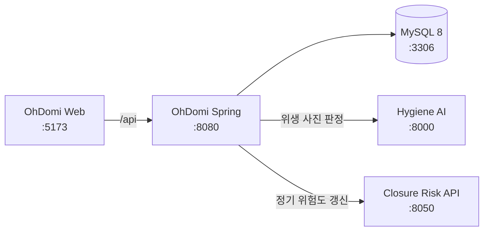

# OhDomi Spring API

OhDomi 서비스의 인증, 매장 운영 데이터, 위생 점검, 위험 평가, 게시판과 화면용 통합 응답을 담당하는 Spring Boot 백엔드입니다. MySQL을 영속 저장소로 사용하고 위생 판정 AI와 폐점·재계약 리스크 모델을 연결합니다.

기본 로컬 주소는 `http://localhost:8080`입니다.

## 주요 기능

- 가맹점주·본사 관리자 로그인, 세션, 역할별 접근 제어
- 매장 정보, 직원 일정, 시설 점검 관리
- 매출, 고객 주문, 재고, 발주 추천, 구매 주문 관리
- 사진 기반 위생 AI 호출과 결과·이미지·개선 과제 저장
- 매장 위험 모델 정기 호출과 최신 평가 조회
- 공지사항과 가맹점 문의 게시판
- React 화면에 맞춘 가맹점주·관리자 통합 API
- MySQL 스키마, 마이그레이션, 데모 데이터 초기화

## 시스템 구성



## 기술 스택

- Java 17
- Spring Boot 4.1
- Spring MVC, Validation, Data JPA
- JDBC 기반 조회·쓰기 로직
- MySQL 8, 테스트용 H2
- Gradle Wrapper

## 로컬 실행

### 1. MySQL 시작

기본 설정은 `127.0.0.1:3306`의 `ohdomi` 데이터베이스와 비밀번호가 없는 `root` 계정을 사용합니다. Docker 예시:

```powershell
docker run --name ohdomi-mysql `
  -e MYSQL_ALLOW_EMPTY_PASSWORD=yes `
  -e MYSQL_DATABASE=ohdomi `
  -p 3306:3306 `
  -d mysql:8.0
```

이미 컨테이너를 만든 경우에는 `docker start ohdomi-mysql`을 사용합니다.

### 2. 환경 변수 설정

필요하면 저장소 루트에 `.env`를 만들 수 있습니다. `application.yaml`이 이 파일을 선택적으로 읽습니다.

```dotenv
SPRING_DATASOURCE_URL=jdbc:mysql://127.0.0.1:3306/ohdomi?createDatabaseIfNotExist=true&useUnicode=true&characterEncoding=UTF-8&serverTimezone=Asia/Seoul
MYSQL_USER=root
MYSQL_PASSWORD=
HYGIENE_AI_BASE_URL=http://127.0.0.1:8000
RISK_MODEL_BASE_URL=http://127.0.0.1:8050
RISK_MODEL_PREDICT_PATH=/risk/predict
RISK_MODEL_REFRESH_ENABLED=true
RISK_MODEL_REFRESH_CRON=0 0 3 * * *
RISK_MODEL_REFRESH_ZONE=Asia/Seoul
```

### 3. 서버 시작

```powershell
.\gradlew.bat bootRun
```

macOS 또는 Linux:

```bash
./gradlew bootRun
```

기본 설정에서는 시작할 때 `schema.sql`, `schema-mysql-migrations.sql`, `data.sql`을 순서대로 적용합니다. 기존 DB를 그대로 사용하려면 `SPRING_SQL_INIT_MODE=never`를 지정할 수 있지만, 빈 DB에서 이 값을 사용하면 테이블과 기본 데이터가 만들어지지 않습니다.

### 통합 실행

OhDomi의 네 저장소가 같은 상위 작업 폴더에 준비되어 있다면 통합 실행 스크립트를 사용할 수 있습니다.

```powershell
..\start-all-servers.bat --check
..\start-all-servers.bat
```

통합 스크립트는 Hygiene AI `:8000`, Risk API `:8050`, Spring `:8080`, React `:5173`을 각각 별도 창에서 실행합니다. 현재 스크립트는 기존 로컬 DB 보존을 위해 `SPRING_SQL_INIT_MODE=never`를 지정하므로 최초 DB 구성은 먼저 단독 실행으로 완료하세요.

## 환경 변수

| 변수 | 기본값 | 설명 |
| --- | --- | --- |
| `SPRING_DATASOURCE_URL` | `jdbc:mysql://127.0.0.1:3306/ohdomi...` | MySQL JDBC URL |
| `MYSQL_USER` | `root` | DB 사용자 |
| `MYSQL_PASSWORD` | 빈 문자열 | DB 비밀번호 |
| `SPRING_SQL_INIT_MODE` | `always` | 스키마·데모 데이터 초기화 여부 |
| `HYGIENE_AI_BASE_URL` | `http://127.0.0.1:8000` | Hygiene AI 주소 |
| `RISK_MODEL_BASE_URL` | `http://127.0.0.1:8001` | 위험 모델 주소. 통합 로컬 환경은 `8050` 사용 |
| `RISK_MODEL_PREDICT_PATH` | `/risk/predict` | 매장 위험 예측 경로 |
| `RISK_MODEL_REFRESH_ENABLED` | `true` | 위험 평가 정기 갱신 여부 |
| `RISK_MODEL_REFRESH_CRON` | `0 0 3 * * *` | 위험 평가 갱신 cron |
| `RISK_MODEL_REFRESH_ZONE` | `Asia/Seoul` | 스케줄 시간대 |

## 데모 계정

`data.sql`이 적용된 로컬 DB에서는 다음 계정을 사용할 수 있습니다.

| 역할 | 아이디 | 비밀번호 | 연결 매장 |
| --- | --- | --- | --- |
| 본사 관리자 | `admin` | `1234` | 없음 |
| 가맹점주 | `demo` | `1234` | 데모 매장 |

이 계정은 로컬 시연 전용입니다. 외부 배포 전 기본 계정과 비밀번호를 교체하고 불필요한 시드 데이터를 제거하세요.

## 인증과 권한

- 로그인 성공 시 12시간 유효한 `SESSION` HttpOnly 쿠키를 발급합니다.
- 세션은 현재 애플리케이션 메모리에 저장되므로 서버 재시작 시 사라지고 다중 인스턴스 간 공유되지 않습니다.
- `/api/auth/login`, `/api/auth/register`, `/api/auth/logout`, `/api/auth/captcha` 외의 `/api/**` 요청에는 로그인 세션이 필요합니다.
- 경로에 `/admin`이 포함된 API는 관리자만 접근할 수 있습니다.
- 가맹점주가 `/api/stores/{storeId}` 또는 `/api/ui/stores/{storeId}`를 호출할 때는 로그인 계정의 매장 ID와 일치해야 합니다.
- `POST`, `PUT`, `PATCH`, `DELETE` 요청에는 `X-Requested-With: XMLHttpRequest` 헤더가 필요합니다.
- 쿠키는 `Secure; SameSite=None`으로 발급되므로 운영 배포는 HTTPS를 사용해야 합니다.
- 로그인 실패가 5회 누적되면 계정이 15분간 잠깁니다.

로그인 예시:

```powershell
curl.exe -c cookies.txt -X POST http://localhost:8080/api/auth/login `
  -H "Content-Type: application/json" `
  -H "X-Requested-With: XMLHttpRequest" `
  -d '{"loginId":"demo","password":"1234","role":"OWNER"}'

curl.exe -b cookies.txt http://localhost:8080/api/auth/me
```

## API 요약

모든 요청·응답 본문은 JSON을 사용합니다. 위생 사진 분석만 `multipart/form-data`입니다.

### 인증

| Method | Endpoint | 설명 |
| --- | --- | --- |
| `GET` | `/api/auth/captcha` | 회원가입용 산술 CAPTCHA 발급 |
| `POST` | `/api/auth/register` | 가맹점주 계정 생성 |
| `POST` | `/api/auth/login` | 로그인 및 세션 쿠키 발급 |
| `GET` | `/api/auth/me` | 현재 세션 사용자 조회 |
| `POST` | `/api/auth/logout` | 세션 종료 |

회원가입에는 `loginId`, `password`, `name`, `phone`, `privacyConsent`, `captchaToken`, `captchaAnswer`가 필요합니다. 신규 비밀번호는 8~72자이며 영문, 숫자, 특수문자를 모두 포함해야 합니다.

### 매장 운영

| Method | Endpoint | 설명 |
| --- | --- | --- |
| `GET/POST` | `/api/stores` | 매장 목록 조회·생성 |
| `GET/PUT` | `/api/stores/{storeId}` | 매장 상세 조회·수정 |
| `GET/POST` | `/api/stores/{storeId}/staff` | 직원 일정 조회·등록 |
| `GET/POST` | `/api/stores/{storeId}/facilities` | 시설 조회·등록 |
| `POST` | `/api/stores/{storeId}/facilities/{facilityId}/checks` | 시설 점검 등록 |
| `GET` | `/api/stores/{storeId}/sales-summary` | 기간별 매출 요약 |

### 재고·주문·발주

| Method | Endpoint | 설명 |
| --- | --- | --- |
| `GET/POST` | `/api/stores/{storeId}/inventory` | 재고 조회·등록 |
| `PUT` | `/api/stores/{storeId}/inventory/{inventoryItemId}` | 재고 수정 |
| `POST` | `/api/stores/{storeId}/customer-orders` | 고객 주문과 품목 등록 |
| `GET/POST` | `/api/stores/{storeId}/order-recommendations` | 발주 추천 조회·등록 |
| `GET/POST` | `/api/stores/{storeId}/purchase-orders` | 구매 주문 조회·등록 |

### 위생 점검

| Method | Endpoint | 설명 |
| --- | --- | --- |
| `GET` | `/api/hygiene-inspections/check-items` | Hygiene AI 체크리스트 조회 |
| `POST` | `/api/hygiene-inspections/analyze` | 사진 판정 후 결과·이미지 저장 |
| `GET/POST` | `/api/hygiene-inspections` | 점검 목록 조회·수동 점검 등록 |
| `GET` | `/api/hygiene-inspections/{inspectionId}` | 점검 상세 조회 |
| `GET` | `/api/hygiene-inspections/images/{imageId}` | 저장된 원본 이미지 스트리밍 |

`analyze`는 `storeId`, `itemId`, 선택 항목인 `retakeCount`, `image`를 받습니다. JPG, PNG, WebP 파일을 지원하며 최대 크기는 10MB입니다.

### 위험 평가와 게시판

| Method | Endpoint | 설명 |
| --- | --- | --- |
| `GET` | `/api/risk-assessments/latest` | 매장별 최신 위험 평가 조회. `level=1..5` 필터 지원 |
| `GET/POST` | `/api/board/posts` | 게시글 목록·등록 |
| `GET` | `/api/board/posts/{postId}` | 게시글 상세 조회 |
| `PATCH` | `/api/board/posts/{postId}/pin` | 공지 고정 상태 변경 |
| `POST` | `/api/board/posts/{postId}/answer` | 문의 답변 등록·수정 |

### 화면 통합 API

| Method | Endpoint | 설명 |
| --- | --- | --- |
| `GET` | `/api/ui/stores/{storeId}/overview` | 가맹점주 통합 대시보드 |
| `GET` | `/api/ui/stores/{storeId}/management` | 매장·시설·직원 관리 화면 |
| `GET` | `/api/ui/stores/{storeId}/hygiene` | 위생 점검 화면 |
| `GET` | `/api/ui/stores/{storeId}/orders` | 발주 화면 |
| `GET` | `/api/ui/stores/{storeId}/sales` | 매출 화면. `period` 쿼리 지원 |
| `GET` | `/api/ui/admin/overview` | 관리자 통합 대시보드 |
| `GET` | `/api/ui/admin/stores` | 전체 가맹점 관리 |
| `GET` | `/api/ui/admin/risks` | 위험 평가 요약 |
| `GET` | `/api/ui/admin/hygiene` | 전체 위생 현황 |
| `GET` | `/api/ui/admin/sales` | 전체 매출 분석 |

`GET /api/test`는 애플리케이션 응답을 확인하는 간단한 엔드포인트지만 다른 `/api/**` 경로와 동일하게 로그인 세션이 필요합니다.

## 오류 응답

처리된 오류는 다음 형태를 사용합니다.

```json
{
  "timestamp": "2026-08-21T00:00:00Z",
  "status": 404,
  "error": "Not Found",
  "error_code": "NOT_FOUND",
  "message": "요청한 리소스를 찾을 수 없습니다."
}
```

주요 상태 코드는 `400`(요청·검증 오류), `401`(로그인 필요), `403`(권한·CSRF 거부), `404`(리소스 없음), `409`(중복), `502`(Hygiene AI 호출 실패)입니다.

## 데이터베이스와 시드

- `src/main/resources/schema.sql`: 기본 테이블과 인덱스
- `src/main/resources/schema-mysql-migrations.sql`: 기존 DB 보완용 멱등 마이그레이션
- `src/main/resources/data.sql`: 기본 계정과 데모 운영 데이터
- [`docs/ERD.md`](docs/ERD.md): 엔터티 관계와 테이블 설명
- `kimgane_*.sql`: 발표·시연용 매장, 매출, 위험, 위생, 재고 데이터와 일부 롤백 스크립트

대용량 시드 SQL은 대상 매장 ID와 현재 데이터 유무를 확인한 뒤 적용하세요. `*_rollback.sql`은 대응되는 시드 범위만 되돌리도록 작성되어 있으므로 파일을 함께 보관합니다.

## 테스트와 빌드

```powershell
.\gradlew.bat test
.\gradlew.bat bootJar
```

빌드 결과는 `build/libs/`에 생성됩니다.

## 디렉터리 구조

```text
src/main/java/com/ohdomi/backend/
  auth/       로그인, CAPTCHA, 세션, 권한 필터
  board/      공지·문의 게시판
  hygiene/    AI 연동, 점검·이미지 저장
  order/      재고, 주문, 발주
  report/     React 화면용 통합 응답
  risk/       위험 모델 연동과 평가 조회
  store/      매장, 직원, 시설, 매출
src/main/resources/ 스키마, 마이그레이션, 데모 데이터, 설정
src/test/           통합·컨트롤러 테스트
docs/               ERD와 데이터 이관 자료
local-dev/          Windows 로컬 설치·실행 보조 스크립트
```

## 운영 전 확인사항

- 현재 세션 저장소는 단일 인스턴스 메모리 방식입니다. 다중 인스턴스 운영 전 Redis나 DB 기반 세션으로 교체해야 합니다.
- 매장 ID가 경로에 있는 API는 가맹점주 소유권을 검사하지만, 일부 쿼리 파라미터 기반 조회는 컨트롤러 단위 검사가 추가로 필요합니다.
- CORS 허용 오리진은 코드에 등록되어 있습니다. 실제 배포 도메인만 남기고 프런트엔드 설정과 함께 검증하세요.
- 운영 DB에서는 기본 계정과 데모 시드 자동 입력을 비활성화하세요.
- 위생 AI와 위험 모델의 타임아웃·장애 응답을 모니터링하고, 모델·데이터 버전을 결과와 함께 추적하세요.

## 관련 저장소

- [OhDomiReact](https://github.com/OhDomi/OhDomiReact) — 통합 웹 대시보드
- [hygiene_ai](https://github.com/OhDomi/hygiene_ai) — 사진 기반 위생 판정
- [closure-risk-model](https://github.com/OhDomi/closure-risk-model) — 폐점·재계약 위험 및 상권 분석
